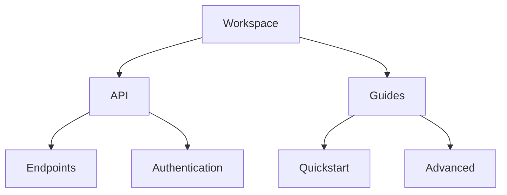

## Overview

Валерий Медведев provides a comprehensive platform for organizing, editing, and sharing your project documentation. You can create structured hierarchies, collaborate with teams, and quickly retrieve information using powerful search tools. This guide covers the core features that make documentation management efficient and scalable.

<Columns cols={3}>
  <Card title="Hierarchy Setup" icon="layout" href="#document-organization">
    Build nested document structures with folders and pages.
  </Card>
  <Card title="Rich Editing" icon="edit-3" href="#editing-formatting">
    Format content using Markdown and visual tools.
  </Card>
  <Card title="Team Collaboration" icon="users" href="#collaboration">
    Share, review, and co-edit documents seamlessly.
  </Card>
</Columns>

## Document Organization and Hierarchy Setup

Organize your documentation into a clear hierarchy using folders and pages. You start by creating a root workspace, then nest pages under folders for logical grouping, such as `/api/reference` or `/guides/quickstart`.



<Steps>
  <Step title="Create Workspace" icon="folder-plus">

    Navigate to your dashboard and click "New Workspace".

  </Step>
  <Step title="Add Folders" icon="folder">

    Right-click the workspace and select "New Folder".

````bash
# Example structure in your project
docs/
  ├── api/
  │   └── endpoints.mdx
  └── guides/
      └── quickstart.mdx
````

  </Step>
  <Step title="Nest Pages" icon="file-text">

    Drag pages into folders to establish hierarchy.

  </Step>
</Steps>

## Editing and Formatting Options

Edit documents with Markdown support, including syntax highlighting, tables, and embeds. You access the visual editor for WYSIWYG formatting or switch to source mode for precise control.

<Tabs>
  <Tab title="Markdown" icon="code">

    Use standard Markdown syntax enhanced with MDX components.

````mdx
## Heading

- List item
- Another item

| Feature | Description |
|---------|-------------|
| Tabs    | Multi-platform |
````

  </Tab>
  <Tab title="Visual Editor" icon="edit-3">

    Drag-and-drop images and format text without code.

    <Callout kind="tip">
      Preview changes in real-time as you edit.
    </Callout>

  </Tab>
</Tabs>

<CodeGroup tabs="JavaScript,Python">
```javascript
// Embed code examples
const apiCall = async () => {
  const response = await fetch(`https://api.example.com/users`);
  return response.json();
};
```
```python
# Multi-language support
import requests
response = requests.get("https://api.example.com/users")
data = response.json()
```
</CodeGroup>

## Collaboration and Sharing Features

Invite team members to collaborate in real-time. You assign roles like Editor or Viewer, track changes with version history, and share public links.

<Callout kind="info">
  Enable notifications for @mentions and page updates to stay in sync.
</Callout>

<Steps>
  <Step title="Invite Collaborators" icon="user-plus">

    Go to Workspace Settings > Members > Invite by email.

  </Step>
  <Step title="Share Links" icon="share-2">

    Generate public or password-protected links.

````bash
# Share via CLI (optional integration)
valery-share --page /guides/quickstart --public
````

  </Step>
  <Step title="Review Changes" icon="git-branch">

    Use the history panel to compare versions and approve edits.

  </Step>
</Steps>

## Search and Retrieval Functionalities

Search across your entire workspace with full-text indexing. You filter by tags, folders, or content type, and retrieve results instantly.

| Search Type | Capabilities |
|-------------|--------------|
| Full-Text   | Matches keywords in titles and body |
| Advanced    | Filters by tags, date, author |
| Global      | Searches all workspaces |

<Expandable title="Advanced Search Tips" default-open="false">

  Use operators like `tag:api` or `author:you` for precise queries.

  Example: `"authentication setup" tag:guide`

</Expandable>

These features empower you to maintain professional documentation effortlessly. Explore the [quickstart](/quickstart) for hands-on setup.